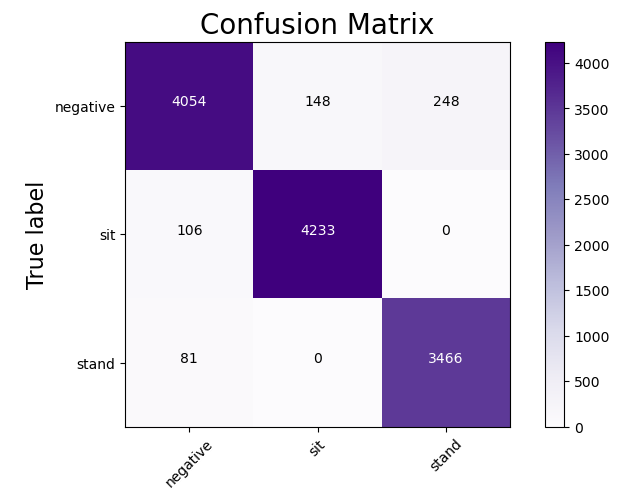

# Sit_Stand_Classification_With_CNN_4_layers

This model will pretty predict sit,stand and neither sit nor stand condition with accuracy is not perfect though. I trained this model with convolutional four layers and max-pooling. The confusion matrix on the test images is as follow: 

